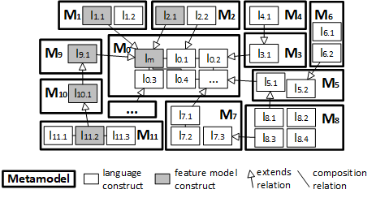

# Extensible and modular abstract syntax for feature modeling based on language constructs
This repository contains all the resources and artifacts of the paper entitled **Extensible and modular abstract syntax for feature modeling based on language constructs** submitted in the *24th International Systems and Software Product Line Conference (SPLC 2020)* by the authors José Miguel Horcas, Mónica Pinto, and Lidia Fuentes.

This corresponds with the implementation in EMF/Ecore of the approach proposed in the paper as a proof of concepts: a set of extensible and modular metamodels defining the abstract syntax of language constructs for feature modeling along with the associated artifacts (model transformations in Henshin, code, tests).

## Artifacts
* [Set of metamodels](fms.metamodel/model/) specifying the language constructs for feature modeling (*.ecore* files). [Actually, BasicFMs (M0), Abstract Features (M1), Basic Constraints (M15), Advanced Constraints (M16), Cardinality-basedFMs (M3, M4), Non-BooleanFMs (M8), and NumericalFMs (M9) are available]

* [Java code](fms.metamodel/src-gen/uma/caosd/rhea/) with the implementation of the metamodels classes.

* [Language generators](rhea.modularmetamodel/src/main/resources/models/BasicFMs/) as model transformations in Henshin (*.henshin* and *.henshin_diagram* files) implementing the generators for language constructs. [Actually, generators for Basic Feature Models are available).

* [Model transformations](rhea.modularmetamodel/src/main/java/uma/caosd/rhea/modularmetamodel/transformations) implementing code generators with the concrete syntax for existing languages and tools. [Actually, M2T transformations for Clafer is available].

* [Custom Henshin engine](rhea.modularmetamodel/src/main/java/uma/caosd/rhea/modularmetamodel) to compute feature models by applying a given set of language constructs using their language generators.

* [Expressiveness analysis](rhea.modularmetamodel/src/test/java/uma/caosd/rhea/modularmetamodel/henshin/ExpressivenessTest.java) for languages built using a given set of metamodels and language constructs.

## Requirements
- Java JDK 11+
- Eclipse for Java & DSL Developers
- Henshin 1.4+
- Maven 3.6+

## How to
#### Install
0. We assume you have Java and Maven properly installed in your computer.
1. Download Eclipse for Java & DSL Developers (last version) from [here](https://www.eclipse.org/).
2. Install the Ecore Tools from the Marketplace.
3. Install Henshin using its update site: http://download.eclipse.org/modeling/emft/henshin/updates/nightly
4. Clone this repository into the Eclipse workspace.
5. Load the projects as existing Maven projects.

#### Usage
###### Working with metamodels and feature models
* Metamodels (*.ecore* files) can be examined and edited using its associated diagram (*.aird* file) using the Ecore Tools, or directly (without diagram) using the Sample Reflective Ecore Editor.
* If modified, the associated generated code with the classes of the metamodel need to be updated (use the *.genmodel* file).
* Feature models instances can be created using the metamodels. Right click on the feature model constructs (e.g., `Feature Model` in *BasicFMs.ecore*) and select `Create dynamic instance`.
* Use the Sample Reflective Ecore Editor to build the feature model (*fm.xmi*) using the language constructs of the metamodel.
* If multiple metamodels are needed, load them as a resource. Right click on the Editor and select `Load Resource`.

###### Working with model transformations
* Henshin transformations can be examined and edited using its associated diagram (*.henshin_diagram* file) with the Henshin Graphical Editor, directly using also the Sample Reflective Editor (*.henshin* file).
* Transformation rules can be executed directly from its diagram. For example, to use the language generators specified for BasicFMs use this [Henshin file](rhea.modularmetamodel/src/main/resources/models/BasicFMs/BasicFMsGenerators.henshin_diagram). Right click on the rule and select `Apply Transformation`. Then select the feature model (*fm.xmi*) and provide required rule parameters (e.g., feature name for a new feature). The result is a new feature model (*fm_transformed.xmi*).

###### Building and analyzing feature modeling languages
* Use the [Expressiveness.java class](rhea.modularmetamodel/src/test/java/uma/caosd/rhea/modularmetamodel/henshin/ExpressivenessTest.java). In the class, specify the metamodels to be used (*.ecore* files) along with the language generators (*.henshin* files), and the number of features and concrete features to consider. This class computes all possible feature models applying the language generators and analyzes the expressiveness of the specified language constructs.

  **Note:** The class computes all possible feature models and then for each feature model calculates its valid products using Clafer and ChocoSolver. Current implementation is not efficient and only valid for testing purpose. Also, the class computes all possible software product lines for a given number of features. Take into account all the process of analyzing the expressiveness of a language is a NP-problem, so use it with a low number of features [1..5] for testing purpose.

## References
- [Java JDK](https://www.oracle.com/technetwork/es/java/index.html)
- [Eclipse](https://www.eclipse.org/)
- [Henshin](https://www.eclipse.org/henshin/)
- [Maven](https://maven.apache.org/)
